<div align="center">


# hw-monitor

A hardware and system monitor for Linux, built with Tauri: a Rust backend that reads `/proc`, `/sys`, hwmon, udev and systemd directly, and a React and TypeScript interface on top.

[](https://github.com/husseinhareb/hw-monitor/releases)
[](https://aur.archlinux.org/packages/hw-monitor)
[](https://github.com/husseinhareb/hw-monitor/actions/workflows/ci.yml)
[](LICENSE)

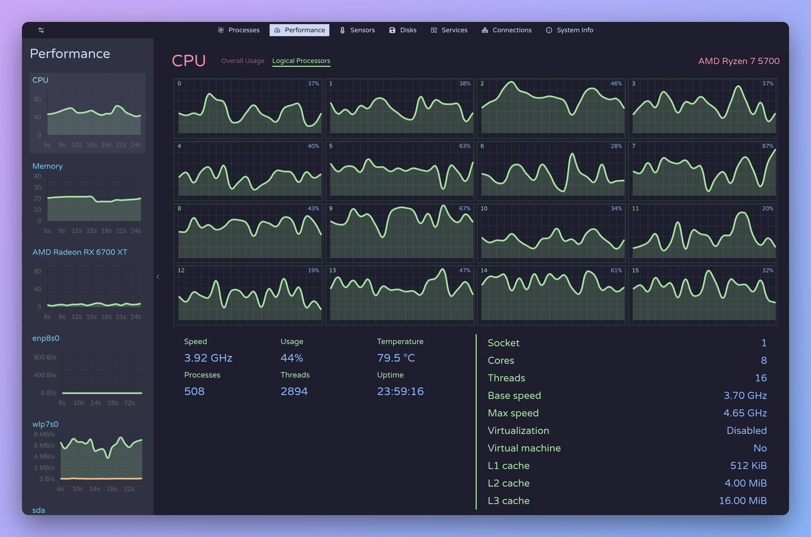

</div>

## Features

- **Processes**: sortable table or tree of every process, with app icons, search, per-process CPU and memory graphs, GPU usage and GPU memory, priority and CPU affinity control, and terminate or force kill
- **Performance**: live graphs for CPU (overall or per logical processor), memory, every GPU, every network interface and every disk, each with a detail panel
- **Sensors**: every hwmon chip, grouped by category, with heat bars, status badges, per-sensor graphs, custom labels and thresholds, and battery details on laptops
- **Disks**: disks and partitions with usage, plus a details view covering hardware, SMART health, queue and discard settings, and I/O counters
- **Services**: systemd services with status and recent logs, start, stop, restart and enable at startup through polkit, and a Startup Apps tab for autostart entries and systemd user services
- **Connections**: every TCP and UDP socket with its owning process and user, and the remote country resolved offline
- **System Info**: OS, kernel, host, CPU, GPU, memory, boot, user, packages, locale and network on one page
- **Customisable**: three bundled themes, nearly every color configurable, per-section update intervals, and eight languages including right-to-left Arabic
- **Tray icon**: closing the window hides it to the tray; Quit from the tray menu exits

## Processes

Every process with its name, PID, parent PID, user, state, memory, CPU usage and GPU usage. More columns can be switched on in the config: GPU memory, disk read and write totals and speeds, and nice value. Click a column to sort, use the search button in the navbar to filter, or switch to the **Tree** view to see parent and child processes. Memory and CPU cells are tinted amber as they get busier.

Selecting a process opens a bottom bar with three actions:

- **Monitor**: live CPU and memory graphs for that process
- **Manage**: set its priority (nice value), choose the CPUs it may run on, or terminate (SIGTERM) or force kill (SIGKILL) it
- **Kill Process**: sends SIGTERM after a second click, so a stray click does nothing

GPU usage and GPU memory are read from the kernel's DRM client statistics in `/proc/<pid>/fdinfo`, which the amdgpu, i915, xe and nouveau drivers provide. The proprietary NVIDIA driver does not expose them.

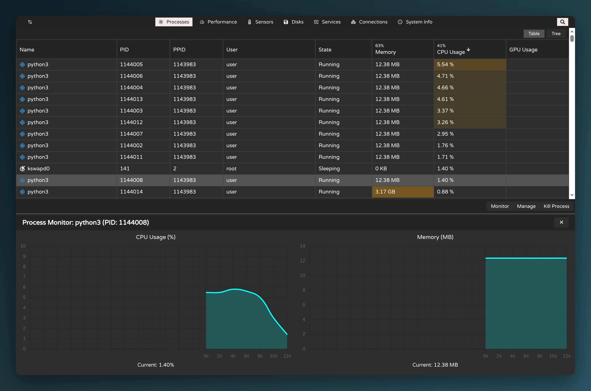

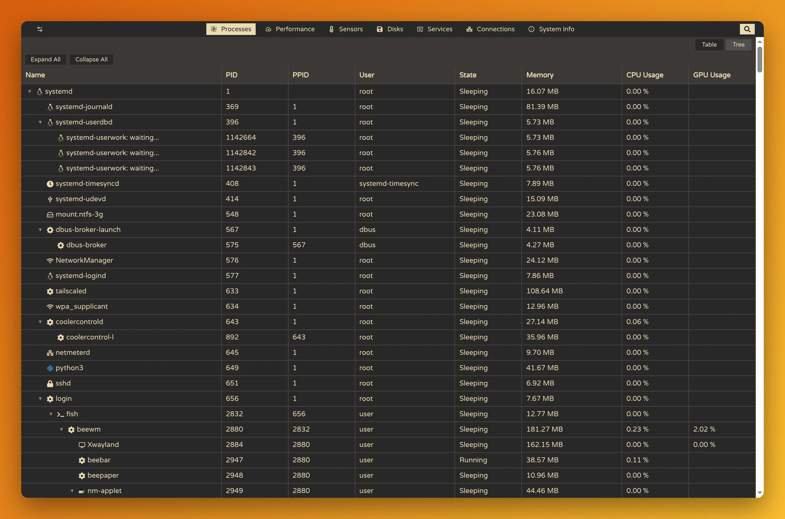

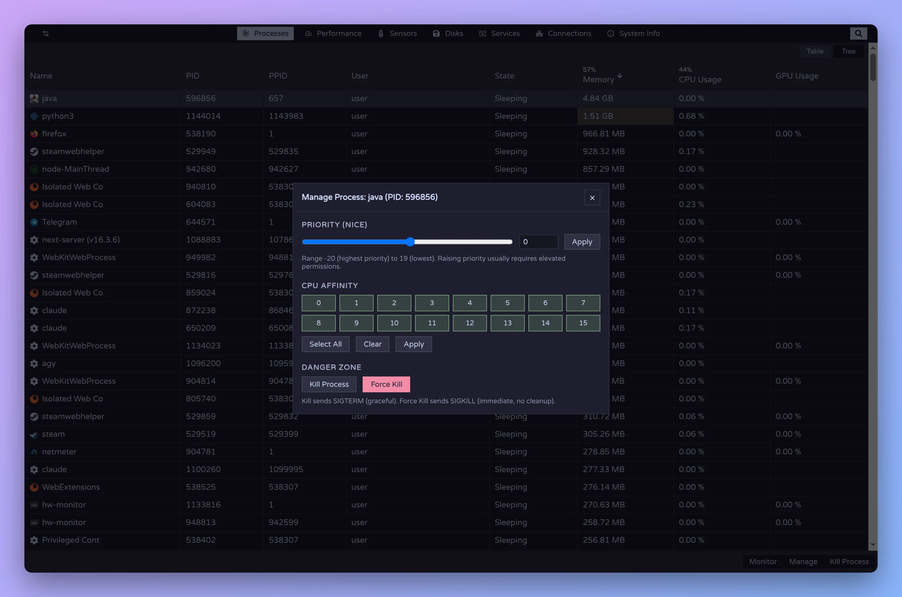

## Performance

A sidebar of small live graphs switches between devices; the selected one gets a full graph and a detail panel. The sidebar can be collapsed.

**CPU**: usage as one graph or as a grid with one graph per logical processor. Current speed, usage, temperature, process and thread counts, uptime, socket, core and thread counts, base and max speed, virtualization support, virtual machine detection, and L1, L2 and L3 cache sizes.

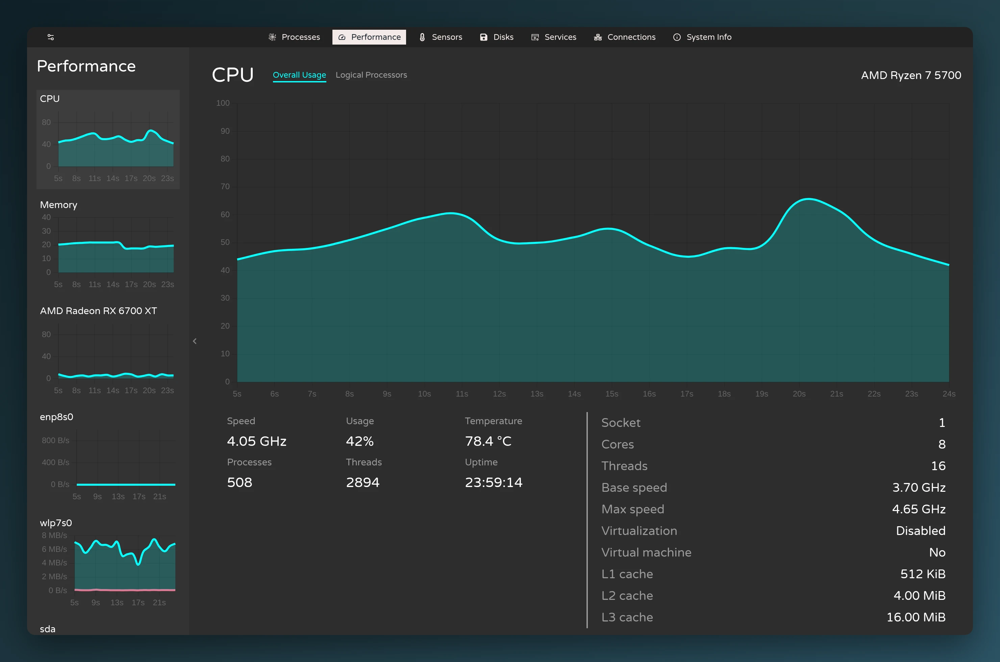

**Memory**: used memory over time, a composition bar splitting RAM into in use, reclaimable and free, totals for free, available, cached and active memory and swap, and the module speed, slots used, form factor and type (read through udev, no root needed).

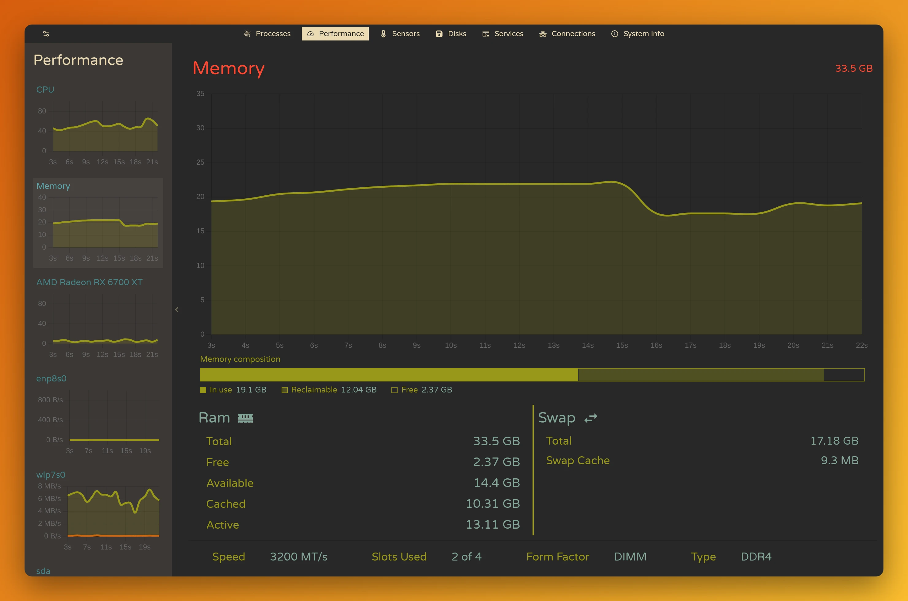

**GPU**: NVIDIA cards through NVML, AMD and Intel cards through sysfs. Usage, clock speed, temperature, power draw, driver version, memory used, free and total, fan speed and performance level.

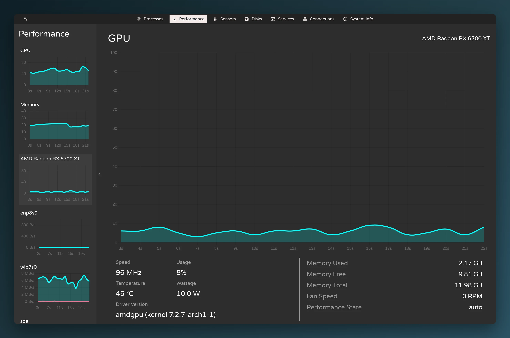

**Network**: download and upload speed for each interface, with type, state, MAC, IPv4 and IPv6 addresses, link speed, Wi-Fi signal, error and drop counters, and total data transferred. Virtual interfaces (docker, veth, bridges, loopback) are hidden unless enabled in the config.

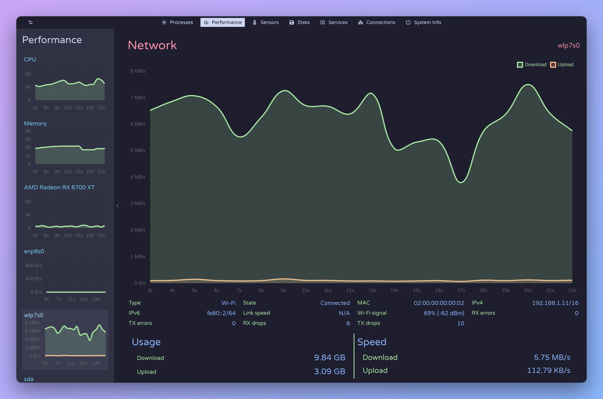

**Disks**: read and write speed for each disk, with total data read and written.

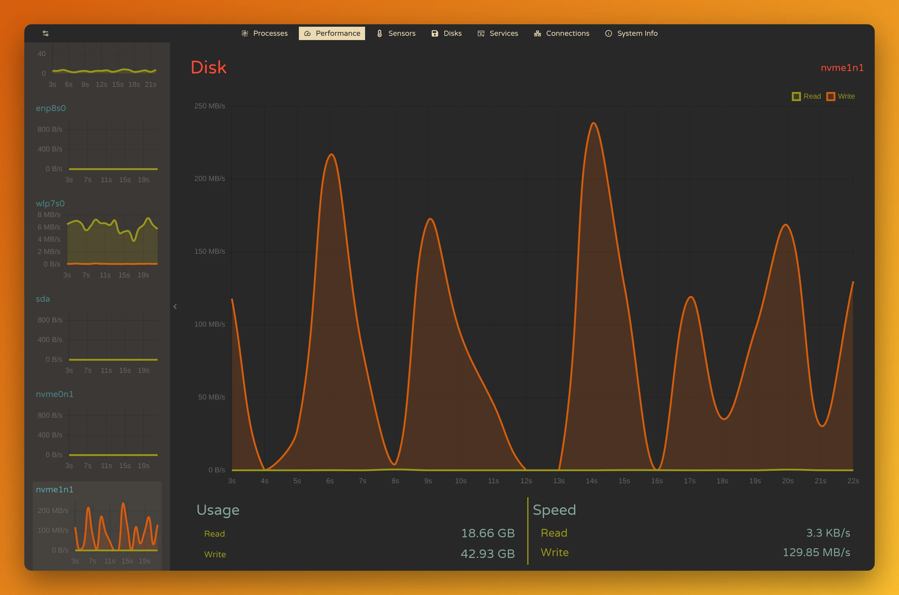

## Sensors

Every sensor under `/sys/class/hwmon` is detected and grouped by chip, then by category: temperatures, fans, voltages, currents, power and energy, PWM controls and intrusion detection. Every sensor gets a status of normal, warning or critical, and sensors with a critical threshold get a heat bar filled up to it (temperatures without one use 100 °C).

Each sensor has three buttons:

- **Graph**: a live graph of recent readings
- **Edit**: set a custom label and your own warning and critical thresholds
- **Hide**: hide the sensor; tick **Show hidden sensors** to see hidden ones again

The toolbar filters sensors by name and collapses or expands every chip. On laptops, a battery card shows charge, model, state, cycle count, energy, time to full or empty, technology, temperature and health.

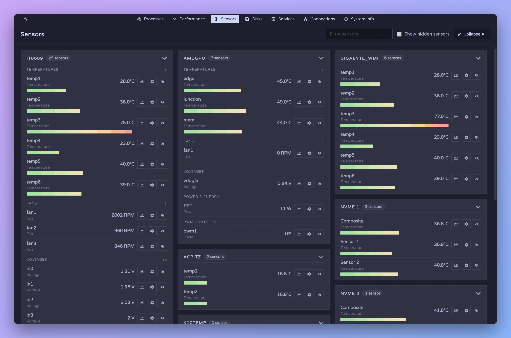

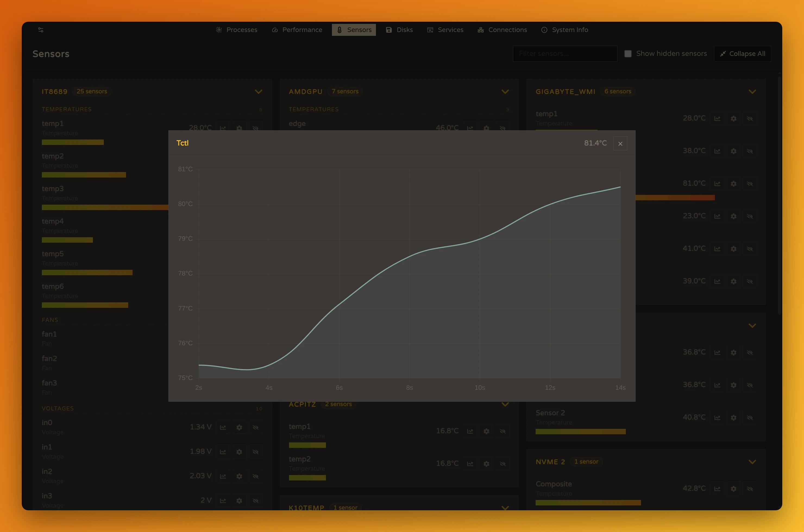

## Disks

Each disk is a card with its model and size, and a row per partition showing its mount point, filesystem and usage. The **i** button opens the full details:

- **Information**: device, transport, vendor, model, serial, size, type, block sizes and sysfs path
- **SMART health**: overall result plus the ATA attribute table, power-on hours, temperature, and reallocated, pending and uncorrectable sectors, or for NVMe drives critical warnings, available spare, percentage used, power cycles, unsafe shutdowns, media errors and data read and written
- **Advanced**: firmware, WWID, schedulers, write cache, queue depth, read-ahead, sector limits, FUA, DAX and zoned mode
- **Discard**: TRIM granularity and limits, and discard counters
- **Controller**, **Performance** (live speeds, IOPS, busy time and totals) and **Partitions**

Reading SMART data needs root or membership in the `disk` group; without it the panel says so.

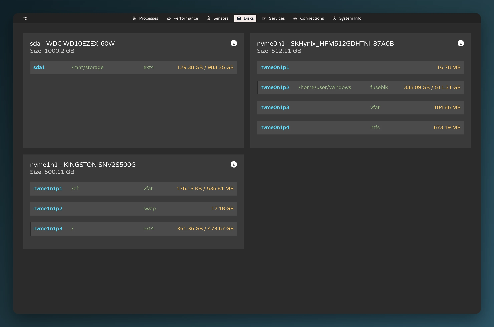

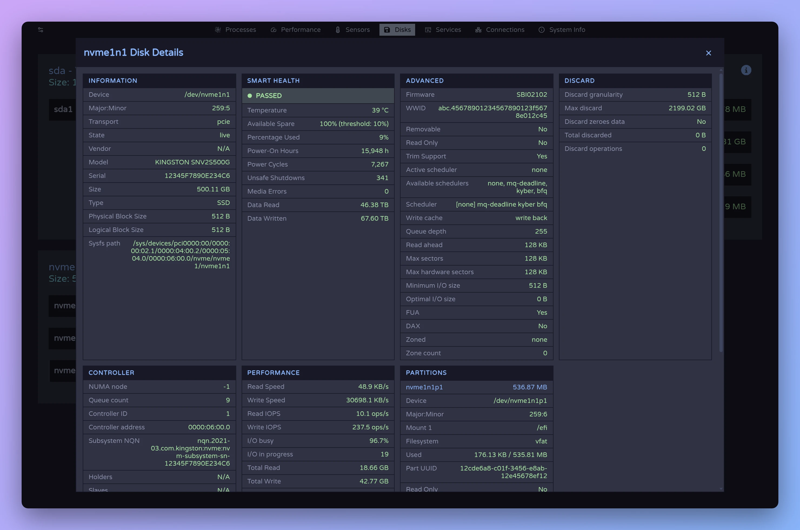

## Services

Every systemd service with its description and load, active, sub and enabled state, searchable and sortable. Selecting a service opens a details panel with its `systemctl status` output, recent journal logs and unit file path, and an action bar with **Start**, **Stop**, **Restart**, **Enable at startup** and **Disable at startup**. Actions run through polkit, so your desktop's authentication dialog asks for the password; hw-monitor never sees it. Template units such as `getty@` cannot be acted on without an instance name, so their actions are disabled.

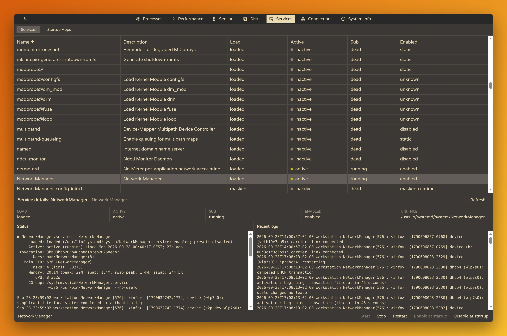

The **Startup Apps** tab lists what starts when you log in: XDG autostart entries from `/etc/xdg/autostart` and `~/.config/autostart`, and systemd user services that start with the session. Enabling or disabling them needs no root: autostart entries get a user override file (system files are never modified), and user services are toggled with `systemctl --user`.

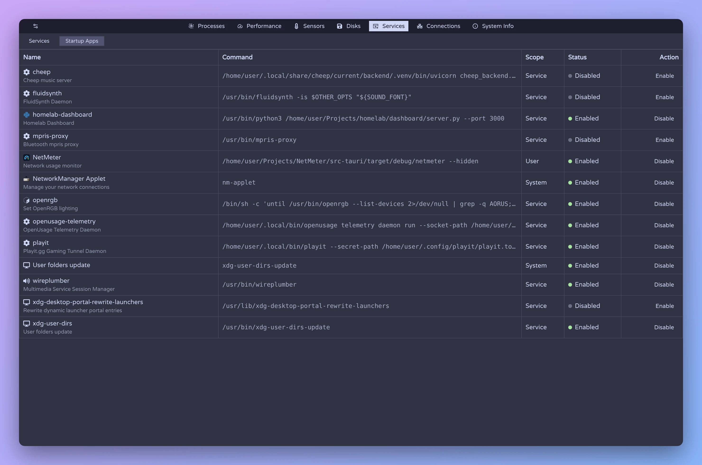

## Connections

Every TCP and UDP socket, read from `/proc/net/tcp`, `tcp6`, `udp` and `udp6`: protocol, local and remote address and port, state, PID, process and user. Remote addresses show a country flag, resolved from a GeoLite2 database compiled into the app, so nothing is looked up over the network. To use a newer database, set `GEOIP_DB_PATH` or place `GeoLite2-Country.mmdb` in `/usr/share/GeoIP/` or `/var/lib/GeoIP/`.

Search across every column, filter by protocol and by state (listening, established or other), and sort any column. Selecting a row shows its full endpoints, process, UID, queue sizes and socket inode. Sockets owned by other users can only be matched to a process with elevated privileges, the same limit `ss` and `netstat` have, and the page says so.

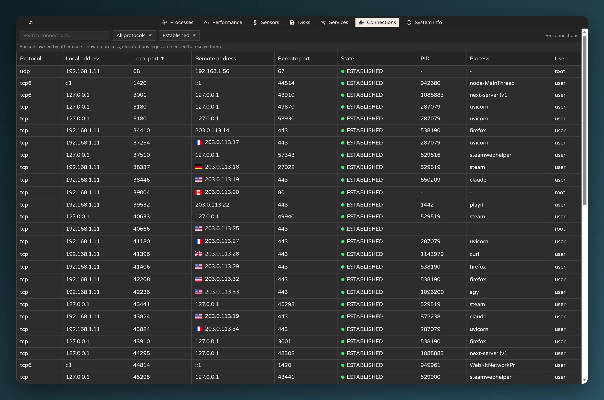

## System Info

Operating system, kernel, host (hostname, chassis, board, product and BIOS), CPU, GPU, memory, boot time and uptime, current user and shell, installed package counts (dpkg, rpm, pacman, apk, flatpak and snap, whichever are present), locale, and network addresses.

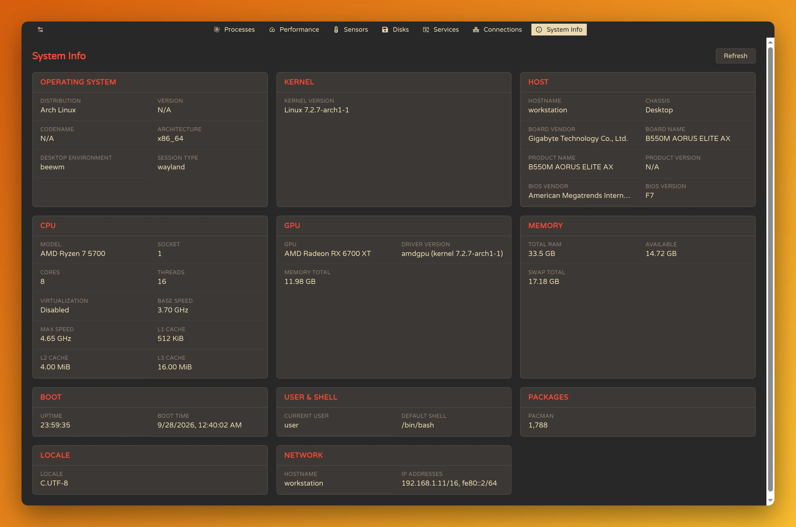

## Themes and Languages

Three themes ship with the app: **Default**, **Catppuccin** (Mocha) and **Gruvbox**. Nearly every color on every page can also be changed individually in the config, and the theme menu shows "Custom theme" once your colors no longer match a preset.

<table>
  <tr>
    <td></td>
    <td></td>
    <td></td>
  </tr>
  <tr>
    <td align="center">Default</td>
    <td align="center">Catppuccin</td>
    <td align="center">Gruvbox</td>
  </tr>
</table>

The interface is translated into English, Arabic, German, Spanish, French, Polish, Russian and Ukrainian. Arabic switches the whole layout to right to left.

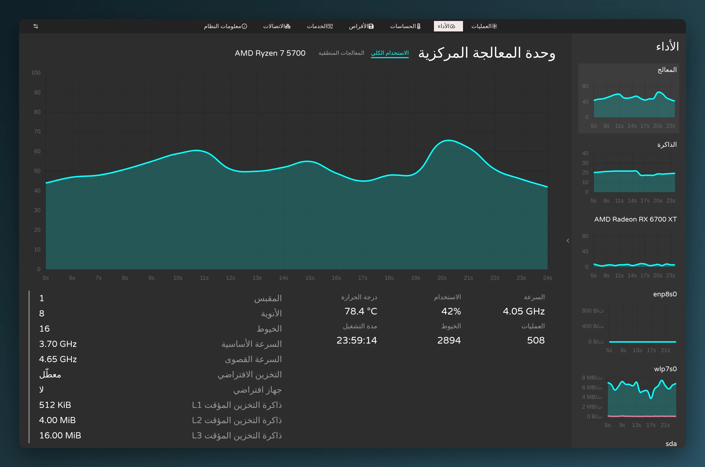

## Configuration

The config page has a section for each page (Processes, Performance, Sensors, Disks, Heat Bars, Navbar, Services, Connections, System Info) and one for the config page itself. It covers colors, the update interval of each page, the visible process columns, and whether virtual network interfaces are shown. The language and theme menus and **Load Default Config** (which asks for a second click) sit in the header.

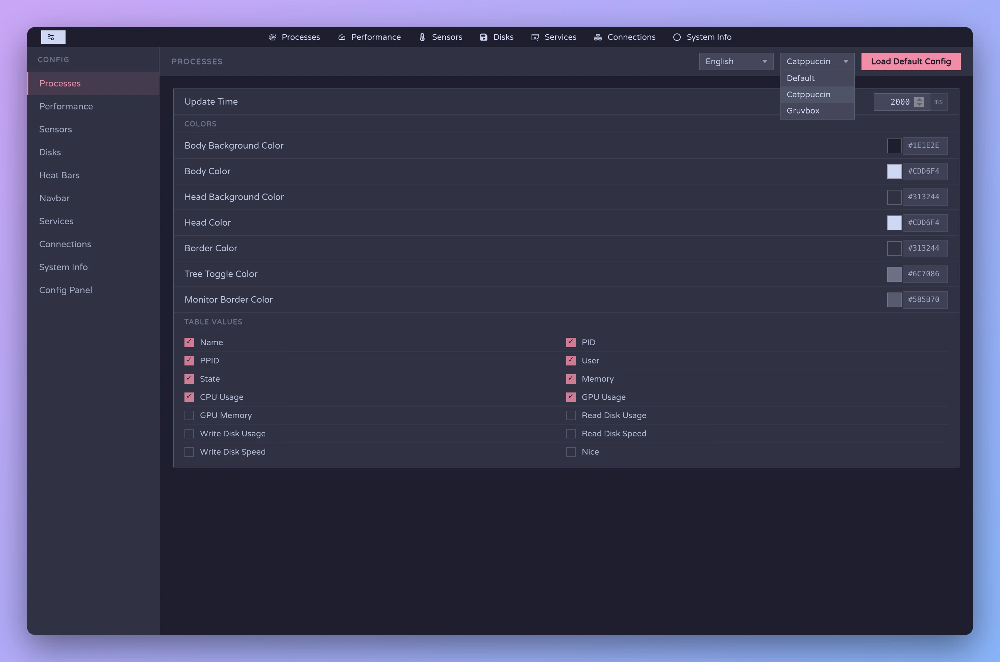

Settings are saved to `~/.config/hw-monitor/hw-monitor.conf` (or `$XDG_CONFIG_HOME/hw-monitor/hw-monitor.conf`), which can also be edited by hand. Sensor labels, thresholds and hidden sensors are stored there too.

## Installation

Packages for every release are on the [releases page](https://github.com/husseinhareb/hw-monitor/releases): a `.deb`, an `.rpm`, an `.AppImage` and a standalone `hw-monitor` binary for x86_64. They need glibc 2.35 or newer (Ubuntu 22.04, Debian 12 or later).

### Arch Linux (AUR)

```bash
yay -S hw-monitor
```

or without an AUR helper:

```bash
git clone https://aur.archlinux.org/hw-monitor.git
cd hw-monitor
makepkg -si
```

### Debian and Ubuntu

```bash
sudo apt install ./hw-monitor_<version>_amd64.deb
```

Installing through `apt` pulls in the dependencies automatically.

### Fedora and other RPM distributions

```bash
sudo dnf install ./hw-monitor-<version>-1.x86_64.rpm
```

### AppImage (any distribution)

```bash
chmod +x hw-monitor_<version>_amd64.AppImage
./hw-monitor_<version>_amd64.AppImage
```

The AppImage bundles WebKitGTK and the other libraries the app needs. If it fails to start with a FUSE error, run it with `--appimage-extract-and-run`.

### Verifying a download

Each release includes a `SHA256SUMS` file and a GitHub build provenance attestation for every artifact. Compare the checksum with the file's line in `SHA256SUMS`, and check the attestation with the GitHub CLI:

```bash
sha256sum hw-monitor_<version>_amd64.deb
gh attestation verify hw-monitor_<version>_amd64.deb --repo husseinhareb/hw-monitor
```

## Troubleshooting

### Missing libraries

The packages above install everything the app needs. When running the standalone binary, install WebKitGTK 4.1 and the Ayatana AppIndicator library yourself; without the latter the app exits at startup with `Failed to load ayatana-appindicator3 or appindicator3 dynamic library`.

| Distribution | Command |
|---|---|
| Arch Linux | `sudo pacman -S webkit2gtk-4.1 libayatana-appindicator` |
| Debian and Ubuntu | `sudo apt install libwebkit2gtk-4.1-0 libayatana-appindicator3-1` |
| Fedora | `sudo dnf install webkit2gtk4.1 libayatana-appindicator-gtk3` |

Service actions also need polkit and a running authentication agent, which desktop environments normally provide.

### NVIDIA GPU rendering errors

With some NVIDIA drivers the window fails to render with errors like:

```
GBM-DRV error (nv_gbm_create_device_native): nv_common_gbm_create_device failed
Failed to create GBM buffer of size 800x600: Permission denied
```

Add these variables to your shell configuration to turn off WebKit's DMA-BUF renderer and use software rendering:

```bash
export WEBKIT_DISABLE_DMABUF_RENDERER=1
export LIBGL_ALWAYS_SOFTWARE=1
export QT_XCB_FORCE_SOFTWARE_OPENGL=1
```

For fish:

```fish
set -Ux WEBKIT_DISABLE_DMABUF_RENDERER 1
set -Ux LIBGL_ALWAYS_SOFTWARE 1
set -Ux QT_XCB_FORCE_SOFTWARE_OPENGL 1
```

### Permissions

hw-monitor runs as your user. A few readings need more:

- **SMART data**: root, or membership in the `disk` group
- **Raising a process's priority** (a negative nice value): root or `CAP_SYS_NICE`
- **Processes behind other users' sockets** on the Connections page: root
- **Service actions**: handled by polkit, which asks for your password

## Building from Source

You need a stable [Rust](https://rustup.rs/) toolchain, [Node.js](https://nodejs.org/) 20.19 or 22.12 and newer, and the [Tauri system dependencies](https://v2.tauri.app/start/prerequisites/). On Debian and Ubuntu, the CI installs:

```bash
sudo apt install libwebkit2gtk-4.1-dev libgtk-3-dev libayatana-appindicator3-dev librsvg2-dev patchelf
```

Then:

```bash
git clone https://github.com/husseinhareb/hw-monitor
cd hw-monitor
npm install
npm run tauri dev      # run in development mode
npm run tauri build    # build the release binary and packages
```

### Developer scripts

| Script | What it does |
|---|---|
| `npm test` | Frontend tests (Vitest) |
| `npm run lint` | ESLint with zero warnings allowed |
| `npm run typecheck` | TypeScript without emitting files |
| `npm run check:bindings` | Checks `src/bindings.ts` matches the Rust command types (regenerated automatically by `npm run dev` and `npm run build`) |
| `npm run check:themes` | Validates the bundled themes: every color key present, valid hex, a monotonic heat bar gradient and readable contrast |
| `npm run screenshots` | Records real backend data from your machine and screenshots every page, tab, modal and menu in headless Chromium into `screenshots/` (gitignored). `-- --size 800x600` sets the window size and `-- --readme` regenerates the images in this README, with usernames, hostnames, addresses and serials replaced |

Backend tests run with `cargo test` in `src-tauri/`. CI runs all of the above plus `cargo fmt --check`, `cargo clippy -D warnings`, `npm audit` and `cargo audit` on every push.

## Changelog

Release notes for every version are on the [releases page](https://github.com/husseinhareb/hw-monitor/releases).

## Contributing

Contributions are welcome. See [CONTRIBUTING.md](CONTRIBUTING.md) for setup and the checks a pull request has to pass.

## License

hw-monitor is licensed under the [MIT License](LICENSE).
